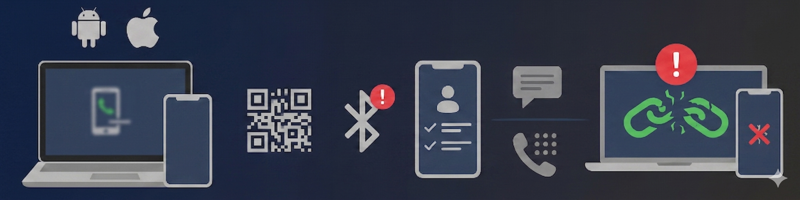
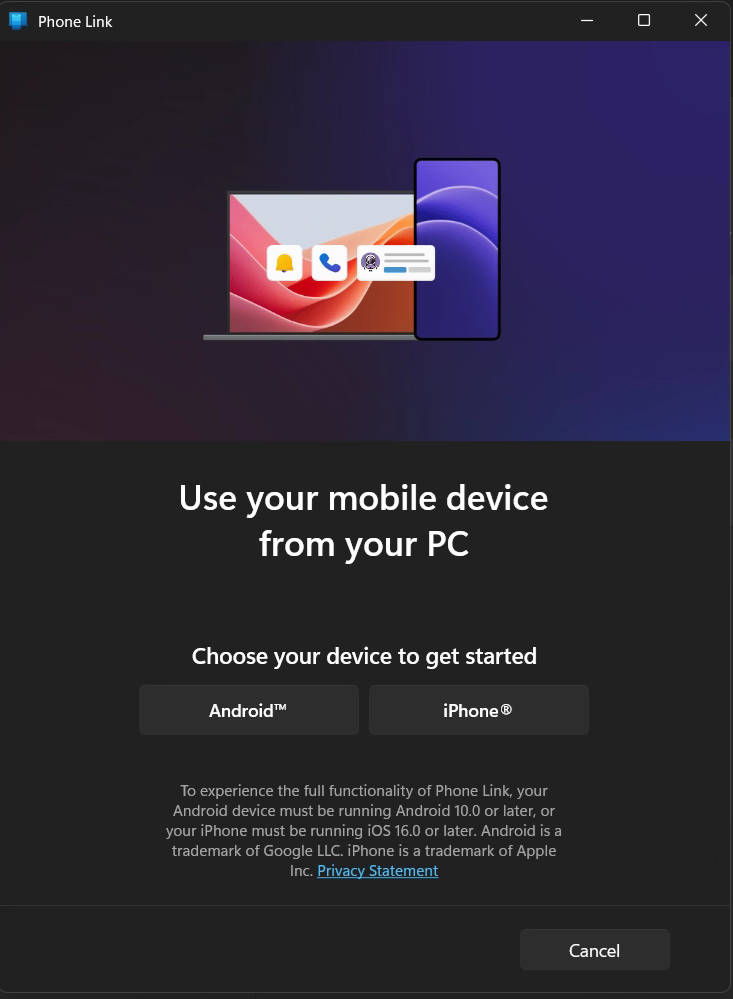
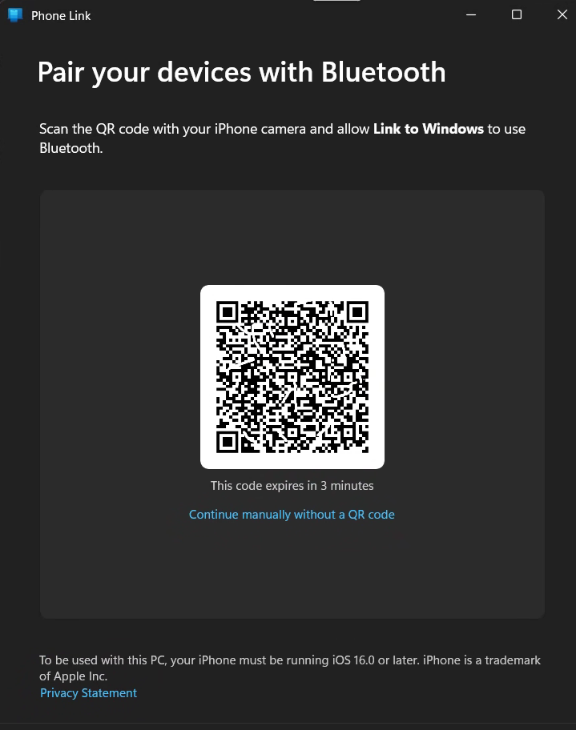
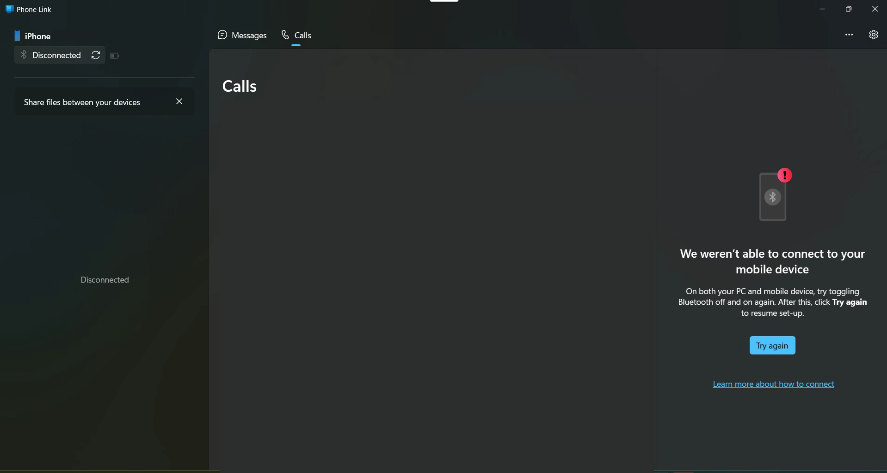
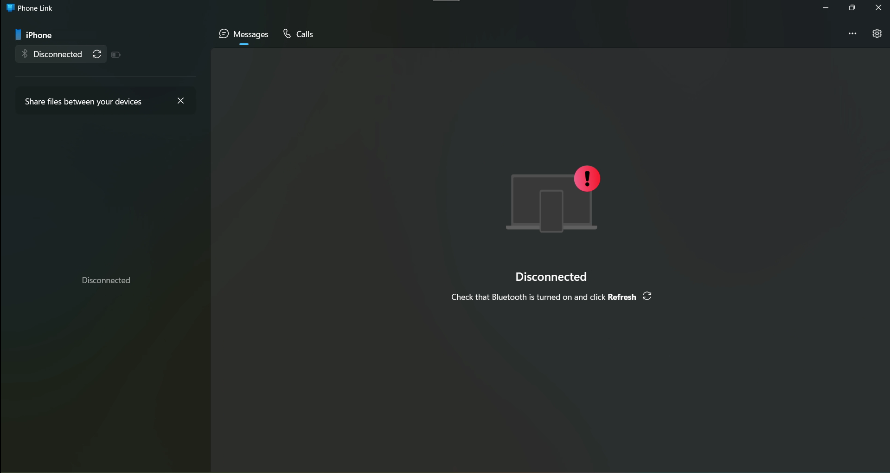
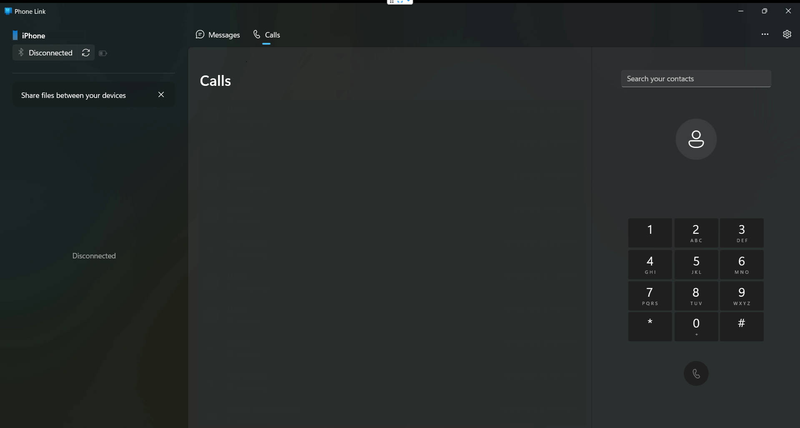
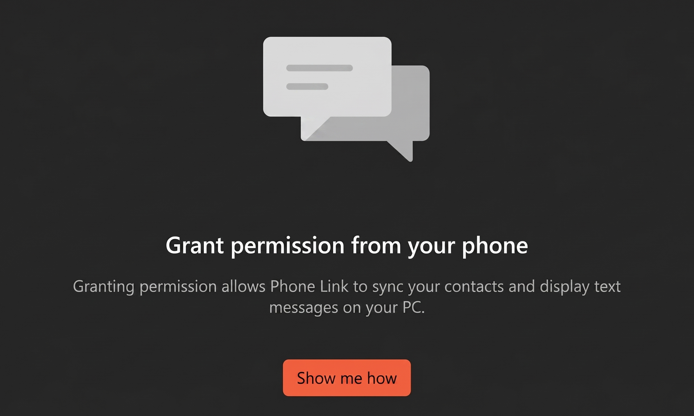
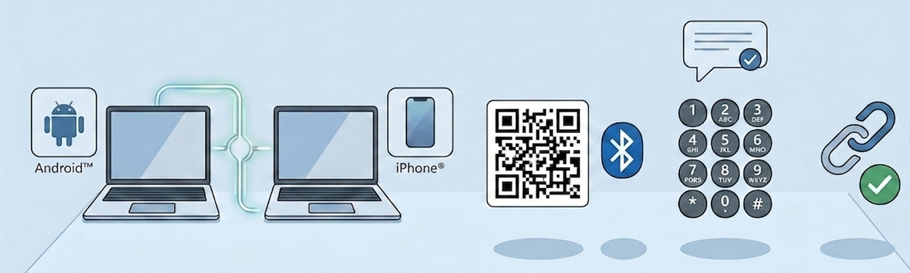

# 🛡️ Phone Link: The Ultimate Guide to Configuring & Troubleshooting

---

    Can't delete — but 
    you can tweak
    !

---

Modern digital workspaces require maximum efficiency and seamless connectivity. Integrating your mobile device with your PC is essential for maintaining smooth workflows. The **Phone Link** application by Microsoft ensures continuous synchronization of your calls, messages, and notifications, allowing you to stay focused on your primary tasks without constantly checking your phone.

If you notice that the Phone Link window repeatedly pops up on your desktop or stays on top of other applications, there's no "delete" button. Hiding or force-closing won't work either. So don't waste time trying — it's a system component. This article explains why the only effective way to restore a seamless, uninterrupted desktop experience is to properly complete its configuration once and for all.

>
> ⚠️ **Please Note:** Attempting to forcibly remove a Windows system component — through third-party tools, registry edits, or manual file deletion — can lead to application errors, update failures, or unexpected system behavior.

---

<h2 id="table-of-contents">Table of Contents</h2>

<ol class="toc">
  <li><a href="#1-what-is-phone-link-and-why-is-it-completely-safe">What is Phone Link and Why is it Completely Safe?</a></li>
  <li><a href="#2-phone-link-is-a-permanent-system-component">Phone Link is a Permanent System Component</a></li>
  <li><a href="#3-why-does-the-application-window-keep-popping-up">Why Does the Application Window Keep Popping Up?</a></li>
  <li><a href="#4-step-by-step-troubleshooting-for-calls-sms-and-notifications">Step-by-Step Troubleshooting for Calls, SMS, and Notifications</a>
    <ul>
      <li><a href="#issue-1-initial-setup-or-dropped-device-link">Issue №1: Initial Setup or Dropped Device Link</a></li>
      <li><a href="#issue-2-bluetooth-connection-error">Issue №2: Bluetooth Connection Error</a></li>
      <li><a href="#issue-3-missing-critical-permissions-on-the-phone">Issue №3: Missing Critical Permissions on the Phone</a></li>
    </ul>
  </li>
  <li><a href="#summary-how-to-keep-phone-link-quiet">Summary: How to Keep Phone Link Quiet</a></li>
</ol>

---

## 1. What is Phone Link and Why is it Completely Safe?

**Phone Link** is an official, native Microsoft tool designed to establish a secure link between your PC and your smartphone (iOS or Android). 

* **Data Protection 🔐:** Device synchronization occurs over a highly secure, encrypted local connection (primarily via Bluetooth and local Wi-Fi). Your personal and corporate data is never transmitted to untrusted external servers.
* **Confidentiality 🛡️:** The application simply mirrors your phone's notifications and interfaces onto your PC monitor. All data remains protected under the overarching umbrella of Windows enterprise security.
* **Efficiency ⚡:** You can answer critical calls, view text notifications, and copy two-factor authentication (SMS) codes directly using your keyboard, keeping your workflow completely uninterrupted.

---

## 2. Phone Link is a Permanent System Component

Because it is embedded deep into the OS core, **it cannot be fully uninstalled or removed** from PC. Any attempts to force-delete it using third-party utilities or by disabling underlying system services will result in critical Windows errors, system instability, and most noticeably increasingly aggressive behavior from the application itself.

When Windows detects that the link is broken or improperly configured, it triggers built-in self-repair protocols. This causes the unconfigured application window to persistently reappear on your screen until the configuration is valid.

---

## 3. Why Does the Application Window Keep Popping Up?

The primary reason Phone Link persistently forces itself to the foreground of your desktop is an **incomplete setup or a dropped connection**.

Windows is intentionally designed to treat an unresolved connection error or a missing permission as a critical communication gap. Instead of running silently in the background, the app brings itself to the front to prompt the user for immediate action. 

**The window will continue to reappear as long as there is even a single error message or uncompleted configuration prompt remaining in its interface.** The only solution to stop this behavior is to resolve all pending connection issues.

---

## 4. Step-by-Step Troubleshooting for Calls, SMS, and Notifications

If your application displays a **"Disconnected"** status or prompts you to start over, follow these step-by-step instructions to restore a stable, silent background connection.

### Issue №1: Initial Setup or Dropped Device Link

If your application has reset or is opening to the initial device selection screen, it means the connection needs to be re-initialized.

**How to fix it:**

1. Click on the button corresponding to your mobile device type (e.g., **iPhone®**).

2. The application will generate a unique QR code on your PC screen.

3. Open your smartphone's camera, scan the QR code, and follow the on-screen prompts to establish a secure Bluetooth pair.

### Issue №2: Bluetooth Connection Error

A common reason for the app popping up is the *"We weren't able to connect to your mobile device"* error in the Calls panel, accompanied by a "Disconnected" indicator in the sidebar.

Alternatively, you may see a general disconnect notice within the Messages interface prompting you to refresh the connection:

**How to fix it:**

1. Double-check that Bluetooth is toggled **ON** 🟢 on both your PC and your mobile phone.
2. In the Phone Link window, click the **"Try again"** button or the **Refresh** icon next to the "Disconnected" status.
3. Even if some elements like the dialer pad appear loaded (as shown below), the system will remain unstable until the status bar officially switches from "Disconnected" to active. If it fails to reconnect, open your phone's Bluetooth settings, choose "Forget this device" for your PC, and re-pair them.

### Issue №3: Missing Critical Permissions on the Phone

If your PC displays the message **"Grant permission from your phone"**, the smartphone's operating system is actively blocking data transmission. The desktop app will continue to disrupt your screen until these permissions are granted.

**How to fix it:**

1. Pick up your phone and open the **Link to Windows** app.
2. Check your phone's notification tray or navigate to *Settings -> Apps -> Link to Windows -> Permissions*.
3. Ensure that permissions for **Contacts, Phone, SMS, and Notifications** are fully enabled.

---

## Summary: How to Keep Phone Link Quiet

Attempting to ignore, minimize, or close the Phone Link window when it's experiencing an error will only cause it to pop up again later. The application is built to run silently in the background without user intervention—but it can only do so when it is healthy.

By taking **just 2 minutes** to walk through the configuration steps, clear out all pending error prompts, and achieve a stable connection status, Phone Link will immediately minimize to your system tray. It will remain running seamlessly in the background, keeping your workstation compliant and completely free of disruptive pop-ups.

